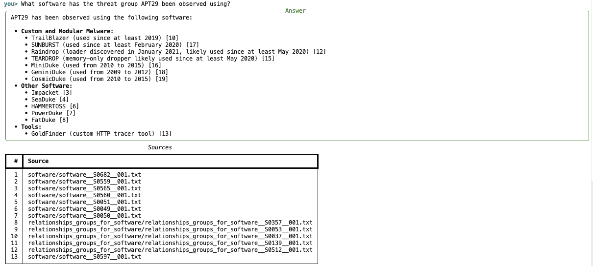

# CyberQA

A retrieval-augmented question answering system for cybersecurity threat
intelligence.



## Quickstart

**Requirements:**

- **Supported OS:** macOS, Linux, or WSL
- **Docker**, running and usable without `sudo` (verify with `docker ps`)
- An **API key** for an OpenAI-compatible LLM
- CyberQA runs local models at query time. It requires a CPU or GPU. Running time will be influenced by which device you use.

### Download and Initialize Environment

```bash
git clone https://github.com/EliassWang/CyberQA.git
cd CyberQA
./initial.sh
```

`initial.sh` is one-time setup that installs everything
and runs the full pipeline in one shot.

It downloads and embeds ~18,000 documents into a local Qdrant instance. Expect roughly **5-15 minutes** on the first run: mostly CPU time for local embedding (no GPU required), plus whatever the corpus and dataset downloads take on your connection.

### Configure

Edit `.env` and set:

- **`LLM_API_KEY`** (required) — API key for your LLM provider.
- **`LLM_MODEL`** (required) — model name as that provider expects it. Must support **tool/function calling**.
- **`LLM_BASE_URL`** (optional) — leave blank for OpenAI's default API, or point at any
  other OpenAI-compatible endpoint (Azure OpenAI, OpenRouter, a local vLLM/Ollama server).

Everything else in `.env.example` (Qdrant connection, retrieval, chunking,
embedding settings) is optional and defaulted — see the comments inline.

Verify the LLM credentials work before moving on:

```bash
uv run python -m llm.provider "say hi"
```

Then:

```bash
uv run python main.py     # interactive chat session
```

### Don't know what to ask?

Here are some sample queries to get you started:

```
What is a potential indicator of the 'T1539: Steal Web Session Cookie' attack technique?
```

See more examples in [examples/sample_queries.md](examples/sample_queries.md).


## Loading documents

This is the manual path. `initial.sh` already runs it for you
automatically with the bundled benchmark corpus. Use these steps yourself
only if you want to point at an existing Qdrant server, ingest your own
documents instead, or re-run ingestion on its own.

**1. Start Qdrant** (skip if `QDRANT_URL` in `.env` already points at a running instance):

```bash
source scripts/qdrant.sh && ensure_qdrant_running
```

**2. Ingest documents** into the `cyberqa_documents` collection. Pick one:

```bash
uv run python -m rag.load_documents        # Benchmarks corpus
```

`rag.load_documents` also takes `--force-download`,
to re-download the corpus even if it's already cached locally.

**3. Ingest your own documents**

```bash
uv run python -m rag.ingest DOCUMENTS_DIR --collection NAME  # your own directory instead
```

The agent only ever searches one collection per run — whatever
`CYBERQA_COLLECTION` in `.env` is set to (defaults to `cyberqa_documents`).
If you ingest into a different `--collection NAME`, set `CYBERQA_COLLECTION=NAME`
in `.env` too, or the agent keeps searching the old collection.

Each collection is tied to one embedding model: switching `EMBEDDING_MODEL` needs a new collection.